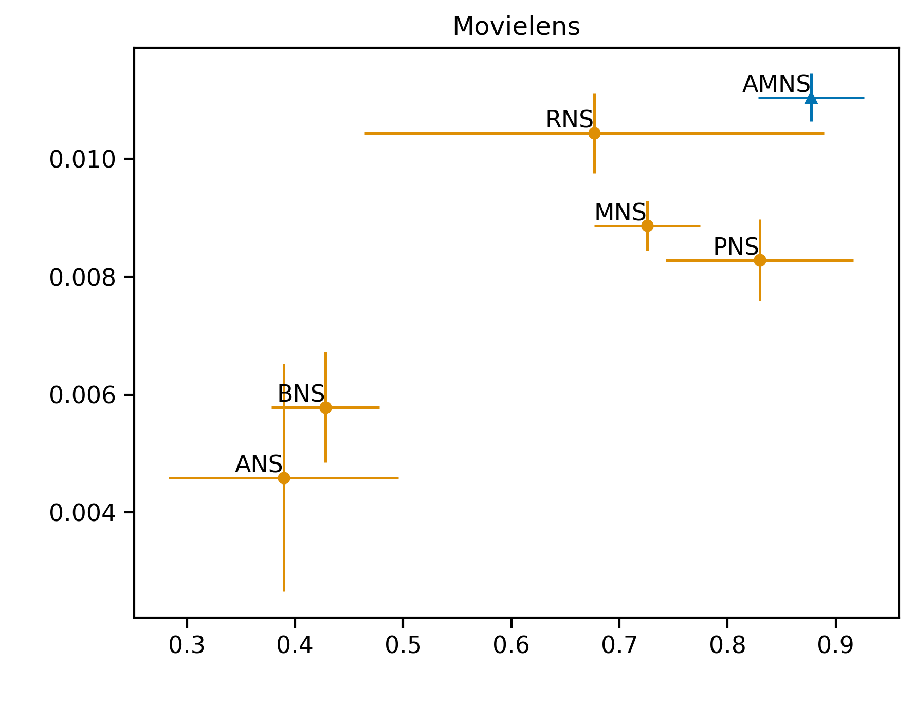
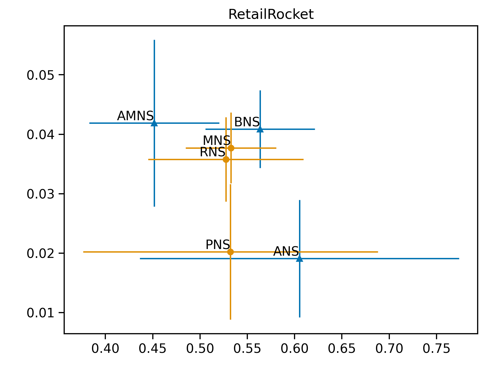
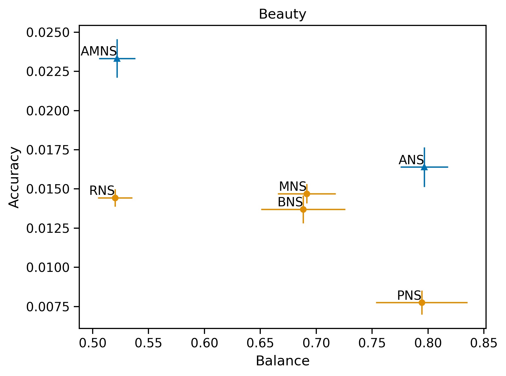

# On The Effectiveness of Negative Sampling Methods For Sequential Recommendations

This [Github repository](http://github.com/apple/ml-negative-sampling) contains the Tensorflow 2 (TF2) code for our paper.
Thank you to the authors of the TF2 implementation of SASRec ([Github](https://github.com/kang205/SASRec))

### Abstract

Industrial scale recommendation models are tasked with selecting the most relevant items for a user from a large catalog of items.
Sequential models predict the most relevant item by utilizing the historical sequence of items that users interacted with.
Training such models requires the selection of a negative sampling technique, as implicit feedback about user preferences
typically only contains positive samples. In this paper, we extend established techniques (uniform, popularity, in-batch,
mixed, adaptive) and propose new ones (inverse popularity, popularity-cohort, adaptive with mixed) to sequential models.
Crucially, we show that the effectiveness of the model in recommending popular, mid, and tail items depends on both the
negative sampling technique and statistics of the dataset. We conduct experiments on public datasets with varying degrees
of popularity bias, and show that adaptive, mixed negative sampling (AMNS) can reduce popularity bias while maintaining
model performance. Our findings provide the reader a reproducible guide to the trade-offs involved in negative sampling
when training recommendation models.

### Main results
Scatter plots of balance across popularity cohorts vs. accuracy (HitRate@10) 
for different negative sampling methods and datasets.


|                                                 |                                      |                                      |
|:-----------------------------------------------:|:------------------------------------:|:------------------------------------:|
|  |  | 

## Running experiments

### 1. Install libraries

```
conda create -q -n sampling_venv python=3.9
conda activate sampling_venv
python3 -m pip install -r requirements.txt
```

### 2. Download Datasets

Links to the datasets used here:

- Retailrocket:
    - [Kaggle Dataset](https://www.kaggle.com/datasets/retailrocket/ecommerce-dataset)
- Amazon Beauty:
    - [Dataset](https://cseweb.ucsd.edu/~jmcauley/datasets/amazon/links.html)
    - [Download Link](http://snap.stanford.edu/data/amazon/productGraph/categoryFiles/ratings_Beauty.csv)
- MovieLens 10M:
    - [Official Website](https://grouplens.org/datasets/movielens/)
    - [Official Download Link](https://files.grouplens.org/datasets/movielens/ml-10m.zip)

Download and rename raw dataset files as  
`data/raw/beauty_full.tsv`  
`data/raw/ml10m_full.tsv`  
`data/raw/retailrocket_full.tsv`  

Run the following to preprocess and time-based splitting of the data into train/validation/test

```
cd data
python DataProcessing.py
```

### 2. Reproduce experiments from the paper

To run a single experiment for any of the 3 datasets, and any of the sampling methods, run a command similar to:

```
python main.py --run_from_config --dataset=Beauty --neg_sampler_type=uniform
```

The hyperparameters for each combination of dataset and sampler (determined by HP search) are located in `all_exp_hp.json`.

To run all experiments multiple times (Monte Carlo runs), run:

```
python all_exp.py --num_exp 20
```

For shorter runtimes, you can reduce the number of experiments.

### 3. Collect results

To collect all individual results into a single .csv file, run:

```
python all_res/collect_results.py
```

This will collect all individual experiment results to `data/all_results.csv`.

NOTE: We have included our own results at the above path.

### 4. Make plots & tables

To plot the scatter plots run:

```
python make_scatter_plots.py
```

To print tables with average accuracies run:

```
python get_average_results.py
```

To plot the frequency plots run:

```
python plot_dist.py
```
